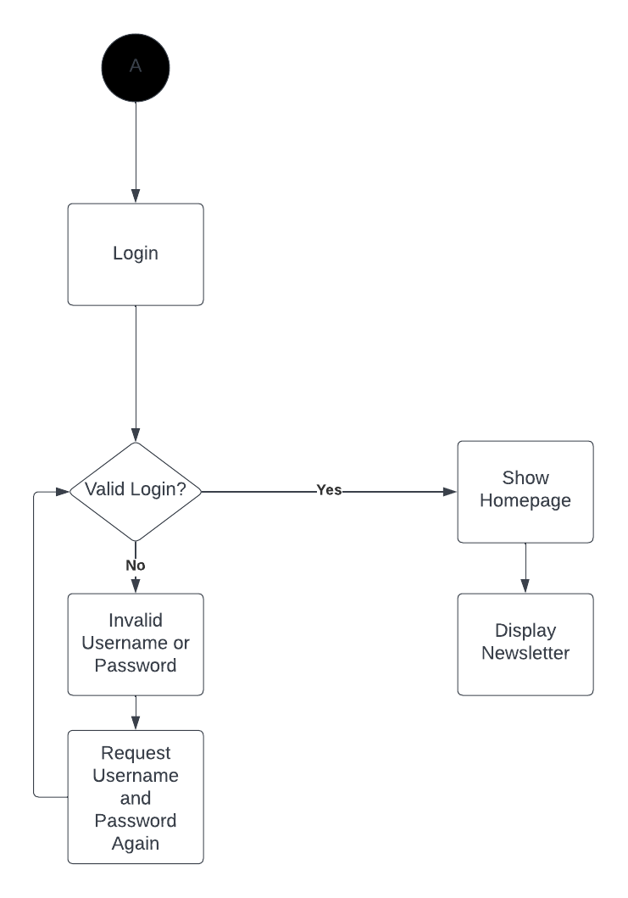

# Specification Phase Exercise

A little exercise to get started with the specification phase of the software development lifecycle. See the [instructions](instructions.md) for more detail.

## Team members

[Charlie Xiang](https://github.com/xiang-charlie)  
[Jenny Shen](https://github.com/JennyShen10792)  
[Khalifa AlFalasi](https://github.com/Khalifa-AlFalasi)  
[Leah Durrett](https://github.com/howtofly-lab)  

## Stakeholders

Omar Qassab is a biology graduate student at NYU, and a graduate assistant at the University Learning Center (ULC). He has been working with the ULC for three years, and has noticed in his time there a few inefficiencies in the system that the ULC uses—ones that can potentially be solved by this app.

### Problems/Frustrations:

#### LAs/Admin:
- Consolidation of necessary information is difficult considering the use of various different apps
- Navigating through each of these apps to find all the required functions and information for each LA is time-consuming and confusing
- ULC newsletter isn’t very prominent

#### Students:
- Students mentioned not knowing the current wait time and traffic at the center before taking the time to commute there. 
- After checking in, students do not have an accurate estimated wait time, how many people are in line before them, when it is their turn with an available tutor, so they cannot leave for extended periods of time.

### Goals/Needs:

#### LAs/Admin:
- App should function as a hub for all necessary functions/info
- Icons should be displayed on the homepage, similarly to the NYU Mobile app
- App should be able to display ULC newsletter

#### Students:
- Having students fill out the current Google Form on their personal devices for increased efficiency and to allow IA’s to have an earlier idea of the traffic and set up sessions.
- Students would like a better gauge of wait times (similar to the traffic tracker of restaurants on Google Maps showing different times of the day during different days of the week).

## Product Vision Statement

See instructions. Delete this line and place your Product Vision Statement here.

## User Requirements

- As an admin, I want to be able to add and remove LAs and IAs to grant them with necessary permissions. 

- As an admin/La, I want the app to serve as a hub to all the necessary functions and data to increase the efficiency of the organization’s work. 

- As a student, I want to know how busy each location is in real time so that I could better plan my schedule.

- As a student, I want to be able to view the newsletter to stay up to date with any updates and announcements. 

- As admin/La/student, I want the app to display icons in the homepage representing the different functions to increase user friendliness.

- As a student, I want to be able to view the schedules of the ULC in order to book a time.

- As a student, I want to be able to book an appointment in order to talk to a Learning Assistant.

- As an LA, I want to be able to communicate with IA’s and other LA’s in order to coordinate appointments.

- As an LA, I want to be able to access old worksheets for group sessions in order to recycle problem sets.

- As an admin, I want to be able to monitor how much students are using the app to measure the effectiveness of the ULC.

## Activity Diagrams

### UML Activity Diagrams

- As a student, I want to know how busy each location is in real time so that I could better plan my schedule.

- As a student, I want to be able to view the newsletter to stay up to date with any updates and announcements.

### Clickable Prototype
